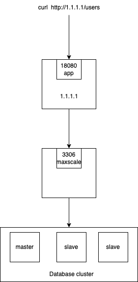

# Mariadb-cluster

    
    

I created a simple RESTful API  in Go for user-management which runs on 18080  and connected to the MariaDB cluster, which is in [this](https://github.com/mona-mp/mariadb-cluster) link.
I make a docker image for it and push it to docker hub.
And at the end,  configure GitLab CI/CD for it.

This application stores new users and their phone numbers.

#### controllers
In usercontroller.go, I have defined four handlers : \
&ensp;1- GetAllUsers: retrieve the records of all the users \
&ensp;2- DeletUserByID: delete specific user by ID \
&ensp;3- CreateUser: create a new user \
&ensp;4- UpdateUserByID: update a users’s record information

I use the [gorilla/mux](https://www.gorillatoolkit.org/pkg/mux) package to implement a request router and dispatcher for matching incoming requests to their respective handler.

#### database connection
For connecting this app to the database, there are two files:\
&ensp; 1- config.go:\
&ensp;&ensp;&ensp; I defined the config structure in this file, and whit the GetConnectionString function, the connectionString was created.

&ensp; 2- connector.go:\
&ensp;&ensp;&ensp;For connecting to database i use [gorm](https://gorm.io/) which is an ORM library for Golang.\
&ensp;&ensp;&ensp;GORM provides CRUD operations and can also be used for the initial migration and creation of the database schema.\
&ensp;&ensp;&ensp;in this file i define two functions :
- Connect: its open connection to the mysql service.
- Migration: this function use gorm AutoMigrate function to automaticly create table.

&ensp;&ensp;&ensp; I leran about ORM technique from blow:\
  &ensp;&ensp;&ensp; &ensp;[Introduction to Object-Relational Mapping](https://www.youtube.com/watch?v=dHQ-I7kr_SY)

#### entity
In this folder is a user.go file which contains and User object for REST(CRUD).

#### main
In main file three functions are defined:
- initDb: it loads .env file to get database config and after that called all functions which are used to connect ro database and create table
- initaliseHandlers: in this function we have four routes which are maped to their related handler.
- main: called initDb and initaliseHandlers functions and create router.

# Preparing GitLab CI/CD
&ensp;This [link](https://www.youtube.com/watch?v=qP8kir2GUgo) helps to learn CI/CD basics.\
&ensp;I just write some bash scripts, define all the automated tasks in a .gitlab-ci.yml file in the root of the repo, and with a few more small configuration steps.Three stages are defined in the CI/CD :
- test: it is an simple automated testing of the Golang code.
- build: just build the docker image and push it to dockerhub.
- deploy:  releasing an app to production.

